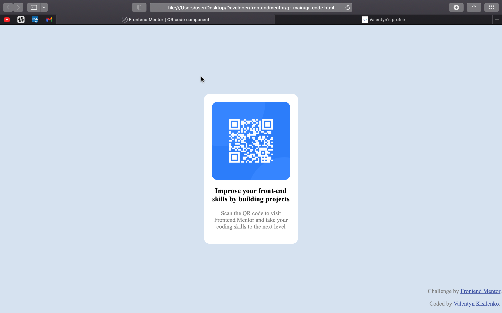

# Frontend Mentor - QR code component solution

This is a solution to the [QR code component challenge on Frontend Mentor](https://www.frontendmentor.io/challenges/qr-code-component-iux_sIO_H). Frontend Mentor challenges help you improve your coding skills by building realistic projects. 

## Table of contents

- [Overview](#overview)
  - [Screenshot](#screenshot)
  - [Links](#links)
  - [Built with](#built-with)
  - [What I learned](#what-i-learned)
- [Author](#author)


## Overview

This is a challenge provided by frontendmentor.
### Screenshot




### Links

- Solution URL: https://github.com/Val77-key/frontendmentor_challenges.git
- Live Site URL: https://val77-key.github.io/frontendmentor_challenges/


### Built with

- Semantic HTML5 markup
- Position property
- css 


### What I learned
I've learned positioning div in the center of the page using position property. Also learned how images behaive inside a div.
```

## Author

- Website - [Valentyn Kisilenko](https://www.your-site.com)
- Frontend Mentor - [@Val77-key](https://www.frontendmentor.io/profile/yourusername)
